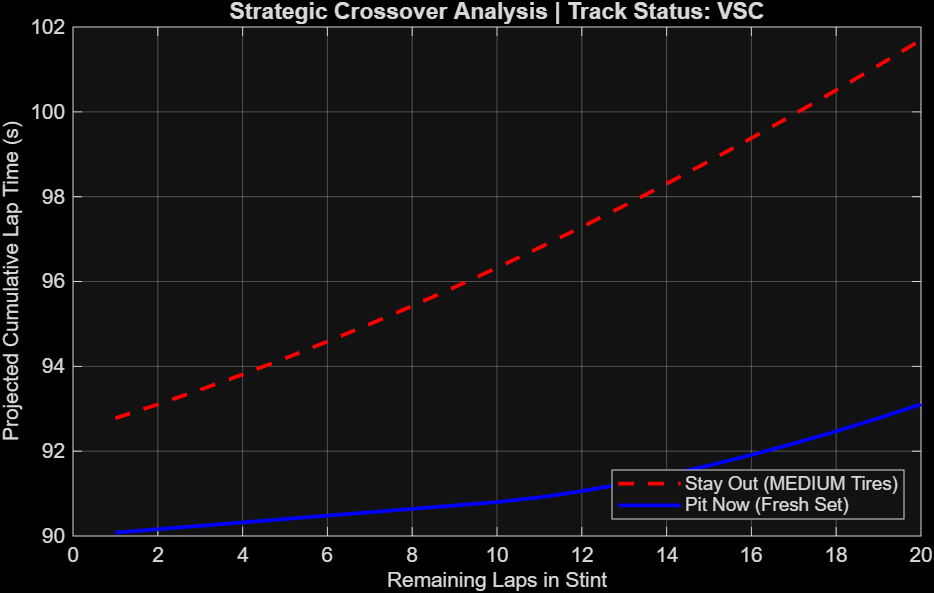

# F1 Race Strategy & DRS Simulation

A professional MATLAB simulation framework modeling Formula 1 race pace over a stint by factoring in non-linear thermal tyre degradation, transient fuel weight burn-off, and state-dependent DRS traffic dynamics.
---

## What It Does

Most basic strategy models treat every lap independently. This script sets up a more realistic race simulation by tracking:
* **Tyre Degradation:** Uses a non-linear exponential wear scale so performance drops off harder as the stint goes on.
* **Fuel Burn:** Accounts for the car getting lighter lap by lap (~1.5kg to 2kg burned per lap), giving a natural pace boost over race distance.
* **Traffic & DRS Logic:** Replaces simple random coin flips with a Markov-style stickiness loop (`sticky_chance`). If you're stuck in a DRS train, it realistically models multi-lap battle persistence and adjusts top-speed benefits based on tyre age.

---

## The Math Behind It

The net lap time ($t_{lap}$) for any given lap ($i$) across an $N$-lap stint is calculated as:

$$t_{lap} = t_{base} + (i^{\beta} \cdot k_{wear}) - ((N - i) \cdot k_{fuel}) - \Delta t_{drs}$$
Where:
* $t_{base}$ = Clean air baseline pace ($90.0\text{ s}$)
* $\beta$ = Tyre wear exponent ($1.2$)
* $k_{wear}$ = Base tyre wear factor ($0.02$)
* $k_{fuel}$ = Fuel weight lap-time gain ($0.07\text{ s/lap}$)
* $\Delta t_{drs}$ = DRS time delta, scaled down slightly if your tyres are too worn to hit peak top speed.
  
## Stint Visualisation
## The Math Behind the Stint Projection

For any given lap $i$ in a remaining stint of $N$ laps, projected lap time is modeled as:

`LapTime_i = base_pace + (wear_rate * age_i) + (cliff * max(0, age_i - cliff_onset)^1.7)`

Cumulative stint times for staying out versus pitting now (accounting for pit-stop delta loss) are evaluated via summation:

`Total_stay = sum( LapTime(tyre_age + i) ) for i = 1 to N`

`Total_pit = pit_loss + sum( LapTime(i) ) for i = 1 to N`

## Repo Layout

f1-strat-optimizers/
├── data/               # Config files & telemetry logs
├── outputs/            # Generated stint analysis plots
├── src/                # Core scripts
│   └── F1_Strategy_With_DRS.m
├── requirements.txt    # Environment notes
└── README.md

# F1 Race Strategy & Pit Window Optimization Engine
---

